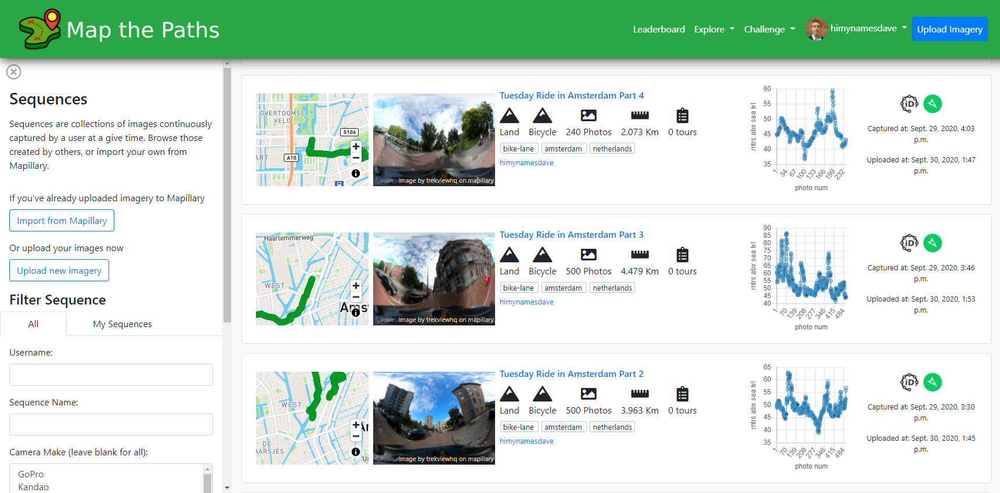

# Map the Paths

## About

Map the Paths is a web application that allows you to share your street-level map imagery.

https://mtp.trekview.org

## Features

* Import images from Mapillary or upload directly using [the desktop uploader](https://mtp.trekview.org).
* Photos: Photos are street-level images that belong to a Sequence
* Sequences: Sequences are collections of images continuously captured by a user at a give time. Browse those created by others, or import your own from Mapillary.
* Tours: Tours are collections of sequences that have been curated by their owner. Browse others' tours or create one using your own sequences.
* Guidebooks: Create a guidebook of street-level photos to show people around a location. View others people have created to help plan your next adventure.
* Challenges: Help make better maps by contributing to challenges with specific requests for imagery.
* Leaderboards: See who is topping the leaderboards for Sequences imported and Viewpoints -- both all time and challenge specific -- to see where you place in the rankings.
* Hire: Find paid help for image collection projects to create fresh street level map data in locations where it's needed for Google Street View, Mapillary, and more...
* API: Integrate your own app with Map the Paths...

## User guide

Need some help getting started? [Go here](https://guides.trekview.org/mtp-web/overview).

## Support

Having problems? [Ask a question around the Campfire (our community forum)](https://campfire.trekview.org/c/support/8).

## Developers

[See the documentation that we've written to help developers understand the logic and function of the Map the Paths](https://guides.trekview.org/mtp-web/developer-docs).

## License

[GNU Affero General Public License v3.0](/LICENSE.txt).

### Deploy on Ubuntu Server.
* git clone https://github.com/trek-view/mtp-web.git
* pip3 install -r requirements.txt
* 
